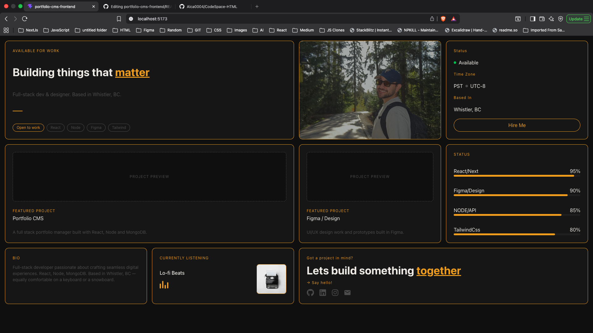
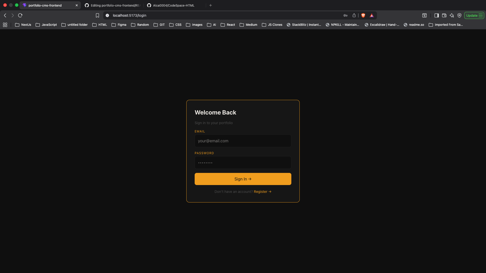
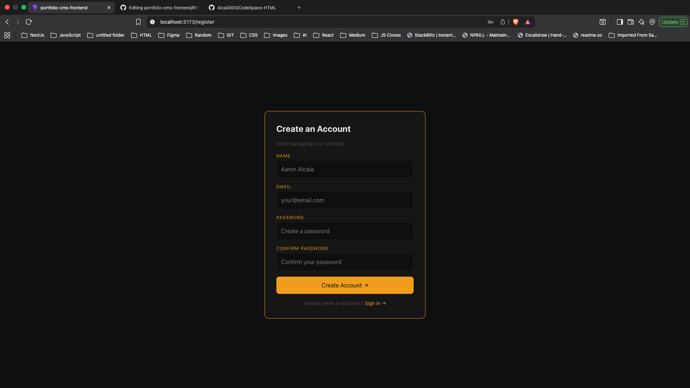
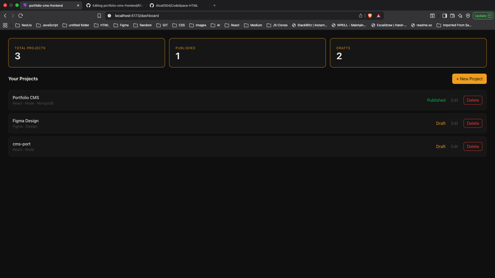
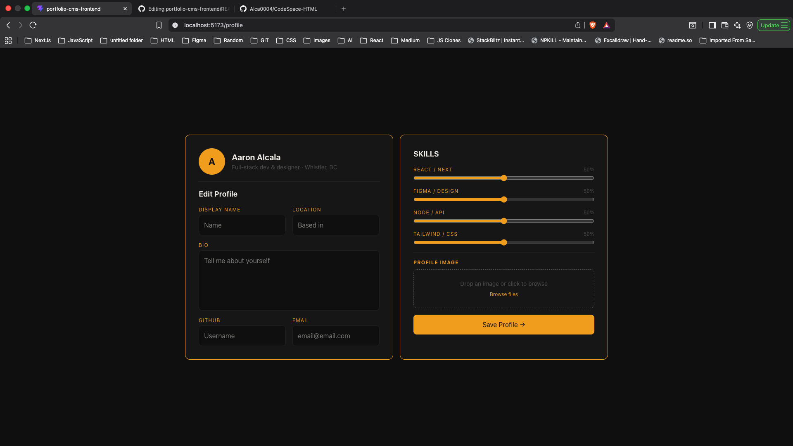

# Portfolio CMS


## My Final Full Stack Project

This is my bootcamp final project. A full stack Portfolio CMS I built from scratch, frontend to backend. The idea was simple: build something I would actually use and be proud to show.

---

## Project Overview

Two sides to this app:

The **public side** is a bento grid portfolio page where visitors can see my projects, skills, and get in touch. No login needed.

The **private side** is a dashboard where I can log in and manage everything. Add projects, delete them, track what's published and what's still a draft. All connected to a real database.

---

## Technologies Used

**Frontend:**

- React + Vite
- Tailwind CSS
- React Router
- Axios
- React Icons

**Backend (separate repo):**

- Node.js + Express
- MongoDB + Mongoose
- JWT Authentication
- bcrypt
- CORS

---

## Key Features

- Bento grid home page with animated equalizer and skill bars
- JWT auth with localStorage persistence
- Protected routes for Dashboard and Profile
- Full CRUD for projects straight from the UI
- New Project modal with instant updates
- Dynamic stats that update in real time
- Custom Noir and Gold design system

---

## Getting Started

### Prerequisites

- Node.js v18+
- npm
- Backend running ([backend repo](https://github.com/Alca0004/portfolio-cms-backend))

### Installation

```bash
git clone https://github.com/Alca0004/portfolio-cms-frontend.git
cd portfolio-cms-frontend
npm install
npm run dev
```

Runs at `http://localhost:5173`

---

## Pages

| Route        | Description     | Access    |
| ------------ | --------------- | --------- |
| `/`          | Portfolio home  | Public    |
| `/login`     | Login           | Public    |
| `/register`  | Register        | Public    |
| `/contact`   | Contact form    | Public    |
| `/dashboard` | Manage projects | Protected |
| `/profile`   | Edit profile    | Protected |

---

## Demo

### Home Page



### Login



### Register



### Dashboard



### Profile



## What I Learned

The hardest part was getting the backend and frontend to actually talk to each other. Auth flow, JWT tokens, protected routes, Axios calls with headers. Once it clicked it felt really good.

Completing a full stack project from scratch was the goal and I got there. Curious, consistent, and a troubleshooter by nature. That's what got this done.

---

## Planned Improvements

- [ ] GitHub API to auto sync public repos as projects
- [ ] Spotify Currently Listening live widget
- [ ] Edit project from Dashboard
- [ ] Mobile responsive design
- [ ] Image upload with Cloudinary
- [ ] Contact form with email (EmailJS)
- [ ] Project filtering and search

---

## Author

**Aaron Alcala**
Full Stack Developer. Based in Whistler, BC.

[GitHub](https://github.com/Alca0004) · [LinkedIn](#)

---

## License

MIT © 2026 Aaron Alcala
